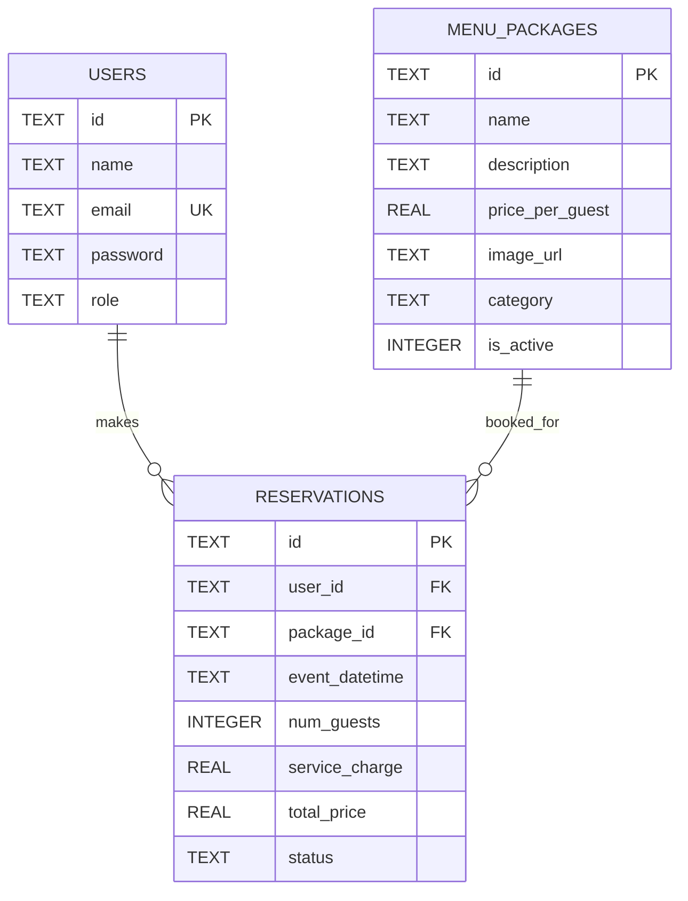

# Restaurant Package Booking Project Report

## 1. Cover Page

Project title: Restaurant Package Booking  
Platform: Android application using Flutter  
Database: SQLite database named `restaurant_package_booking.db`  
Prepared by: Add group member names, IDs, and signatures.

## 2. Requirement Analysis

The application supports high-end restaurant customers who want to book pre-defined menu packages for private events. Unauthenticated guests can browse packages and view descriptions, images, categories, and per-guest prices. Booking requires registration or login. Customers can create, view, update, and cancel reservations. Administrators can manage menu packages, user accounts, and all customer reservations.

Functional requirements:
- Display menu packages to guests without login.
- Provide registration and role-aware login.
- Allow customers to select a package, enter event date, event time, and guest count.
- Calculate total price in real time as `(price per guest x number of guests) + service customization charges`.
- Show a summary screen and success notification after confirmation.
- Allow customers to view, edit, and cancel upcoming reservations.
- Allow administrators to create, read, update, and delete menu packages.
- Allow administrators to view/manage users and customer reservations.
- Provide search and category filtering.

Non-functional requirements:
- Premium and user-friendly interface.
- Local persistence through SQLite.
- Clear architecture using routing, state management, and database service separation.
- Code readability through models and reusable widgets.

## 3. Adopted Software Life Cycle Model

The project uses the Agile model. The system is divided into small modules: authentication, menu browsing, booking, reservation management, and admin management. Each module can be implemented, tested, demonstrated, and improved incrementally. Agile is suitable because interface design and booking workflow details can change after user feedback.

## 4. Module Division

- Guest module: package browsing, package cards, search/filter, login/register guidance.
- Authentication module: customer registration, unified login, role-based routing.
- Customer booking module: booking form, customization options, live pricing, summary, confirmation.
- Reservation module: customer reservation list, update booking, cancel booking.
- Admin package module: package CRUD with name, description, price, image URL, category, active status.
- Admin user module: list and manage users.
- Admin reservation module: view, edit, and cancel all reservations.
- Database module: SQLite table creation, seed data, repository functions.

## 5. Database Design

Database name: `restaurant_package_booking.db`

ER diagram:

Logical tables:

| Table | Field | Data Type | Length | Key | Description |
|---|---|---:|---:|---|---|
| users | id | TEXT | 36 | PK | Unique user ID |
| users | name | TEXT | 100 |  | Full name |
| users | email | TEXT | 120 | UNIQUE | Login email |
| users | password | TEXT | 100 |  | Password for prototype/demo |
| users | role | TEXT | 20 |  | `customer` or `admin` |
| menu_packages | id | TEXT | 36 | PK | Unique package ID |
| menu_packages | name | TEXT | 100 |  | Package name |
| menu_packages | description | TEXT | 500 |  | Package description |
| menu_packages | price_per_guest | REAL | - |  | Base price per guest |
| menu_packages | image_url | TEXT | 500 |  | Image URL |
| menu_packages | category | TEXT | 50 |  | Package category |
| menu_packages | is_active | INTEGER | 1 |  | 1 active, 0 inactive |
| reservations | id | TEXT | 36 | PK | Unique reservation ID |
| reservations | user_id | TEXT | 36 | FK | References `users.id` |
| reservations | package_id | TEXT | 36 | FK | References `menu_packages.id` |
| reservations | event_datetime | TEXT | 30 |  | ISO date and time |
| reservations | num_guests | INTEGER | - |  | Number of guests |
| reservations | service_charge | REAL | - |  | Optional customization charges |
| reservations | total_price | REAL | - |  | Final calculated price |
| reservations | status | TEXT | 20 |  | `confirmed` or `cancelled` |

## 6. Step-by-Step User Guide With Screenshots

Add screenshots after running the app on an emulator or Android device.

1. Open the app. The guest page displays private dining menu packages with images, categories, descriptions, and per-guest prices.
2. Use the search box or category filter to find suitable packages.
3. Tap Login or Register. Customers can register a new account or login with an existing account.
4. Select a package and tap Reserve Package.
5. Choose event date, event time, number of guests, and optional service customizations.
6. Review the live total price displayed on the booking form.
7. Tap Review Summary, confirm the booking, and wait for the success notification.
8. Open My Reservations to view upcoming and past bookings.
9. Edit an upcoming reservation to change package or guest count. The total price recalculates.
10. Cancel an upcoming reservation using the confirmation dialog.
11. Login as administrator and open the admin dashboard.
12. Manage menu packages, user accounts, and all reservations from the admin tabs.

## 7. Repository Link

Add GitHub repository link here after pushing the project.

## 8. Plagiarism Statement, Task Breakdown & Peer Evaluation

We declare that this project is our own work and that all external references, libraries, and resources are acknowledged.

| Member | Main Tasks | Contribution % | Signature |
|---|---|---:|---|
| Member 1 | Authentication, database | 25 |  |
| Member 2 | Guest browsing, booking flow | 25 |  |
| Member 3 | Reservation management | 25 |  |
| Member 4 | Admin module, report, presentation | 25 |  |

Peer evaluation should be completed honestly by all group members before submission.

## 9. References

Flutter. (2026). *Flutter documentation*. https://docs.flutter.dev/

Google. (2026). *Material Design 3*. https://m3.material.io/

Riverpod. (2026). *Riverpod documentation*. https://riverpod.dev/

SQLite. (2026). *SQLite documentation*. https://www.sqlite.org/docs.html

pub.dev. (2026). *go_router package*. https://pub.dev/packages/go_router

pub.dev. (2026). *sqflite package*. https://pub.dev/packages/sqflite
